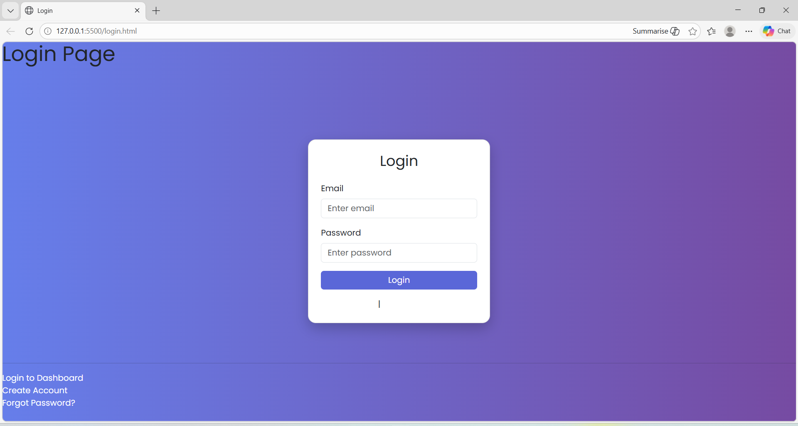
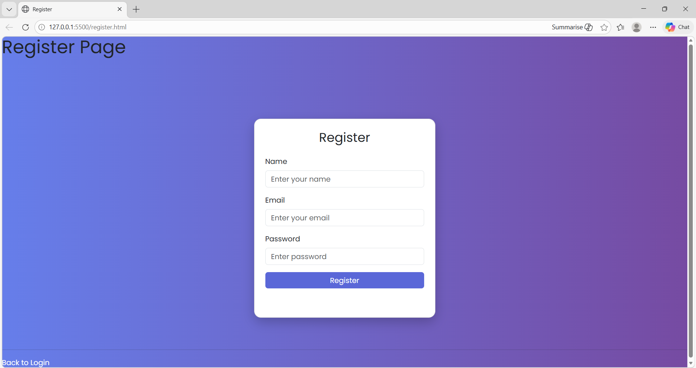
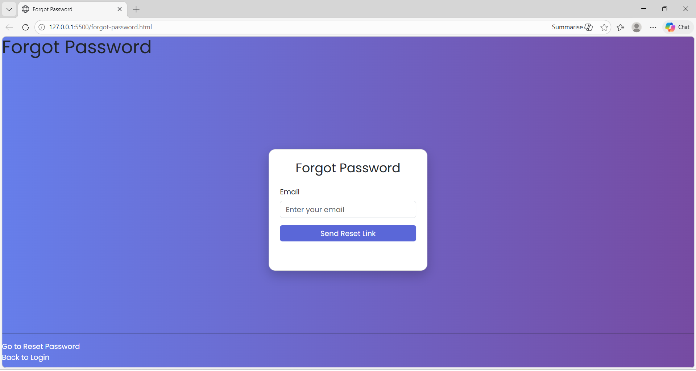
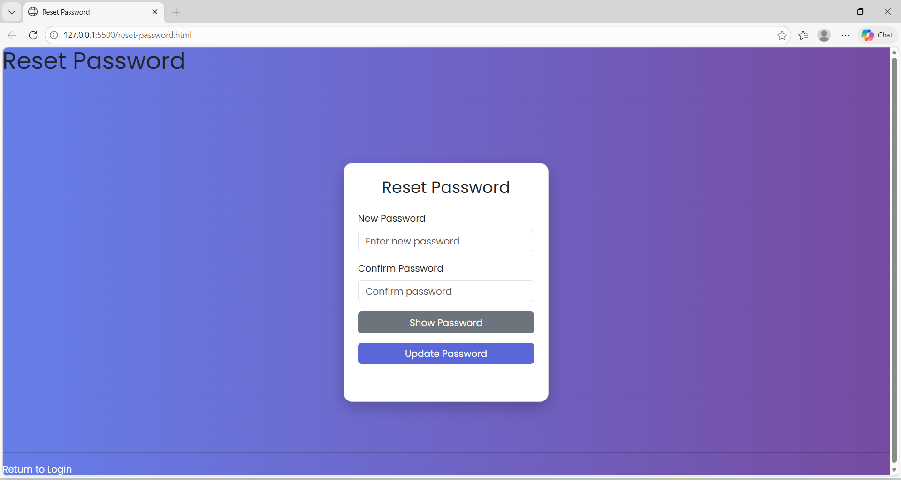
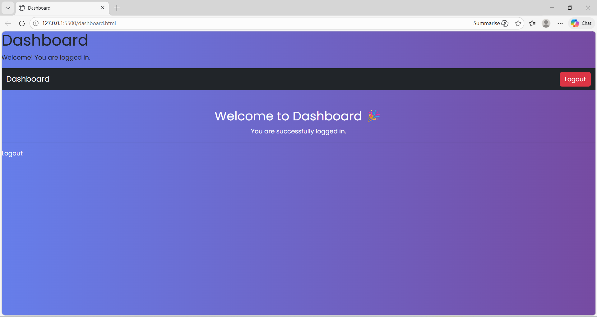

# HTML Authentication System with Bootstrap

This project demonstrates a basic authentication system using HTML, Bootstrap 5, and custom CSS. It includes login, registration, password reset, and dashboard pages with proper navigation.

## Technologies Used
- HTML5
- Bootstrap 5 (CDN)
- CSS3

## Features
- Responsive design (mobile, tablet, desktop)
- Bootstrap card layout for forms
- Styled inputs and buttons
- Password visibility toggle
- Navigation between pages
- Clean dashboard UI

## Pages
- login.html
- register.html
- forgot-password.html
- reset-password.html
- dashboard.html 

## Screenshots

### Login Page

### Register Page

### Forgot Password

### Reset Password

### Dashboard

## Conclusion
This project helped in understanding Bootstrap integration, responsive design, and structuring a basic authentication UI using HTML and CSS.